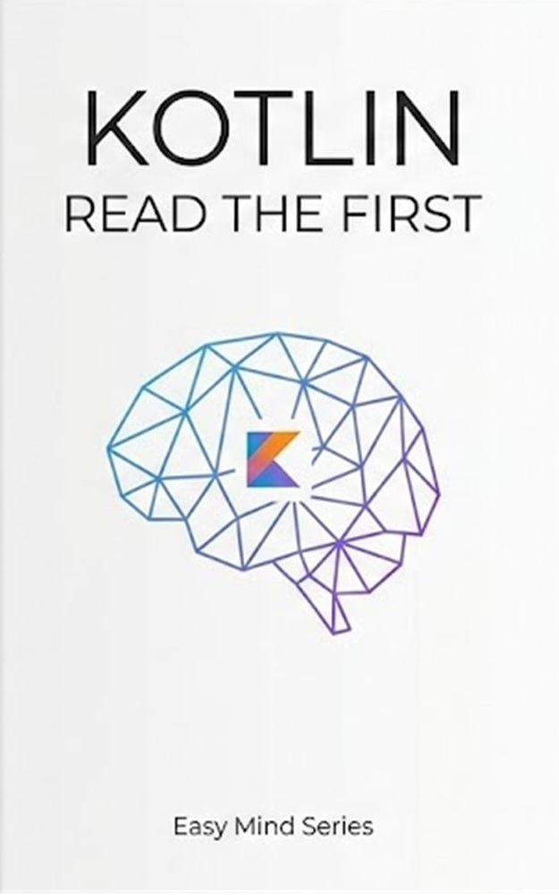

## TL;DR

Kotlin's control flow isn't just about directing execution; it's about expressing intent concisely. This post explores `if`, `when`, `for` loops, ranges, and `try-catch` structures, highlighting Kotlin's expression-oriented design that allows many of these constructs to return values, leading to cleaner, more functional code.

## The Problem

In many programming languages, control flow statements like `if-else` and `switch` are purely imperative. They execute blocks of code but don't inherently return a value. This often leads to verbose code when you need to assign a value based on a condition or handle different cases. For instance, assigning a variable based on a condition usually requires declaring the variable first and then assigning within each branch:

```kotlin
// Traditional imperative approach
var description: String
val number = 10
if (number % 2 == 0) {
    description = "Even"
} else {
    description = "Odd"
}
println(description)
```

Similarly, `switch` statements can become cumbersome with many cases, especially when assigning a result, and they often lack the flexibility for complex conditions or pattern matching that modern languages offer. Handling ranges and iterations can also feel clunky without dedicated, expressive constructs.

## The Solution: Kotlin's Expressive Control Flow

Kotlin elevates control flow by treating many constructs as expressions, meaning they can return a value. This, combined with powerful idiomatic features, drastically simplifies common programming patterns.

### 1. `if` as an Expression

Unlike Java, Kotlin's `if` is an expression, not just a statement. The value of the `if` expression is the value of its last expression within the block. This eliminates boilerplate when conditionally assigning values.

```kotlin
// Using if as an expression
val number = 10
val description = if (number % 2 == 0) "Even" else "Odd"
println(description) // Output: Even
```

This single line achieves what previously took multiple lines and an explicit `var` declaration, making the code more concise and immutable-friendly.

### 2. The Mighty `when` Expression

Kotlin's `when` is a far more powerful and flexible replacement for the `switch` statement. It can be used both as a statement and, crucially, as an expression.

#### Basic `when` and Multiple Conditions

You can match discrete values, and combine multiple conditions into a single branch:

```kotlin
val day = 3
when (day) {
    1 -\u003e println("Monday")
    2 -\u003e println("Tuesday")
    3 -\u003e println("Wednesday")
    else -\u003e println("Unknown")
}

val input = "Y"
when (input) {
    "Y", "y" -\u003e println("Yes") // Multiple conditions
    "N", "n" -\u003e println("No")
    else -\u003e println("Invalid input")
}
```

#### `when` Without a Subject

For highly flexible condition checking, `when` can be used without a subject, where each branch condition is a boolean expression. This effectively becomes a more readable `if-else if` chain:

```kotlin
val age = 22
when { // No subject
    age \u003c 13 -\u003e println("Child")
    age \u003c 20 -\u003e println("Teenager")
    age \u003c 65 -\u003e println("Adult")
    else -\u003e println("Senior")
}
```

#### `when` as an Expression with Ranges

Similar to `if`, `when` can return a value. This is incredibly powerful for implementing complex mapping or categorization logic. It also supports `in` checks for ranges, making conditions even more expressive:

```kotlin
val x = 5
val type = when (x) {
    0 -\u003e "Zero"
    in 1..9 -\u003e "One digit" // Checking if x is within a range
    else -\u003e "Multiple digits"
}
println(type) // Output: One digit
```
This demonstrates how `when` can elegantly handle different types of conditions, including ranges, all while returning a result.

### 3. Idiomatic Loops and Ranges

Kotlin offers familiar `for`, `while`, and `do-while` loops, but its `for` loop is particularly enhanced by ranges and collection iteration.

#### Iterating with `for`

You can iterate directly over ranges, collections, or even use indices:

```kotlin
// Loop through a range
for (i in 1..5) {
    print("$i ")
}
println() // Output: 1 2 3 4 5 

// Loop through a list
val names = listOf("Alice", "Bob", "Charlie")
for (name in names) {
    println(name)
}

// Using indices
val items = listOf("A", "B", "C")
for (i in items.indices) {
    println("$i: ${items[i]}")
}
```

#### Expressive Ranges

Ranges themselves are a powerful feature, allowing for concise definitions of numeric intervals. They can be used directly in `for` loops or with the `in` operator for checks.

```kotlin
// Inclusive range
for (i in 1..5) { print("$i ") } // 1 2 3 4 5 

// Downward range
for (i in 5 downTo 1) { print("$i ") } // 5 4 3 2 1 

// Exclusive end range
for (i in 1 until 5) { print("$i ") } // 1 2 3 4 (5 excluded)

// Range checks
val age = 25
if (age in 18..65) {
    println("Working age") // Output: Working age
}

// Ranges with steps
for (i in 1..10 step 2) { print("$i ") } // 1 3 5 7 9 
```
These range constructs make loop definitions and conditional checks incredibly readable and brief.

### 4. `try/catch` as an Expression

Just like `if` and `when`, `try/catch` blocks in Kotlin can also return a value. The value is the last expression in the `try` block if no exception occurs, or the last expression in the `catch` block if an exception is caught. This is useful for providing fallback values or default results in case of an error.

```kotlin
// try as an expression for safe parsing
val input = "123"
val number: Int = try {
    input.toInt() // Attempt to parse
} catch (e: Exception) {
    0 // Return 0 if parsing fails
}
println(number) // Output: 123

val invalidInput = "abc"
val anotherNumber: Int = try {
    invalidInput.toInt()
} catch (e: Exception) {
    -1 // Return -1 for invalid input
}
println(anotherNumber) // Output: -1
```

This pattern is a powerful way to encapsulate error handling and provide a default or safe value, rather than interrupting the flow with explicit `if (success) { ... } else { ... }` checks after an operation. Traditional `try/catch/finally` still exists for side effects or resource cleanup.

```kotlin
// Basic try/catch with finally
try {
    val result = 10 / 0 // This will throw an ArithmeticException
} catch (e: ArithmeticException) {
    println("Cannot divide by zero.")
} finally {
    println("Operation finished.") // Always executes
}
```

## Key Takeaways

*   **Expressions, Not Just Statements**: Kotlin's `if`, `when`, and `try-catch` are expressions that can return values, leading to more concise and functional code by eliminating the need for temporary variables and explicit assignments.
*   **`when` is a Superpower**: Beyond a simple `switch`, `when` offers unparalleled flexibility for pattern matching, combining conditions, and handling ranges, making complex conditional logic elegant.
*   **Idiomatic Loops and Ranges**: Kotlin's `for` loops work seamlessly with expressive ranges (`..`, `until`, `downTo`, `step`) and collections, simplifying iteration and making code more readable.
*   **Cleaner Error Handling**: Using `try` as an expression allows you to provide direct fallback values for operations that might fail, integrating error handling more smoothly into value assignments.
*   **Reduced Boilerplate, Enhanced Readability**: These features collectively enable you to write more expressive, less verbose, and easier-to-understand code, moving closer to a declarative style of programming.

By embracing these core control flow features and their expression-oriented nature, you can write more efficient, robust, and truly Kotlin-idiomatic applications.

---

### articles/kotlin/chapter3-control-flow-expressions.md

### index.md

Under the `articles` section:
- [Unlocking Kotlin's Control Flow: Beyond Basics with Expressions and Idiomatic Constructs](articles/kotlin/chapter3-control-flow-expressions.md)

---

**[Get the full Easy Mind guide on Amazon](https://www.amazon.com/dp/B0G8H4QX2L/)**

[← Back to Home](https://easy-mind-read.github.io/kotlin-read-the-first-pages/)


## Get the book
- Amazon: [Get Preview](https://www.amazon.com/dp/B0G8H4QX2L/)
- 